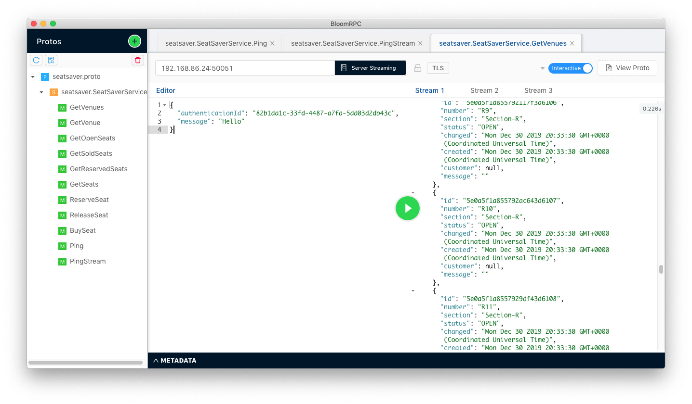

# Seat Saver gRPC

This is an example project that demonstrates how the details of creating and using gRPC under Node.js.

## Running Seat Saver gRPC as a Docker-Compose API
You can run Seat Saver gRPC using Docker Compose. The Docker Compose setup installs a local instance of MongoDB. In 
addition, it will bind MongoDB to Seat Saver gRPC automatically. You don't need to set any environment variables. The
Docker Compose installation process does this for you automatically.

**Step 1:** Clone the project from this GitHub repository as follows:

`git clone https://github.com/reselbob/seat-saver-grpc.git`

**Step 2:** Navigate to the project directory:

`cd seat-saver-grpc`

**Step 3:** Run `docker-compose`

`docker-compose up`

## Running Seat Saver gRPC as a Standalone API

**Step 1:** Clone the project from this GitHub repository as follows:

`git clone https://github.com/reselbob/seat-saver-grpc.git`

**Step 2:** Navigate to the project directory:

`cd seat-saver-grpc`

**Step 3:** Install the dependencies

`npm install`

The application will seed test data when in the MongoDB database when it initializes.
Therefore, the application might take a few minutes to start up initially.

**Step 4:** Export the environment variable, `MONGODB_URL` with the value of the fully qualified URL required
to access the remote or local MongoDB database.

`export MONGODB_URL=<mongo_db_url>`

The application requires that the location of the MongoDB be assigned according to its URL. That URL needs to be assigned to the environment variable, MONGODB_URL.
Should a valid URL not be assigned to MONGODB_URL, the application will NOT start up.

**Step 5:** Start the gRPC API

`node index.js`

**Step 6:** Run the project's unit tests

`npm test`

## Using the BloomRPC GUI to run gRPC calls against Seat Save

BloomRPC is a desktop utility that allows you to configure and execute gRPC calls visually.



You install the BloomRPC GUI on your local machine by following the instructions found at
the project's GitHub respository, [here](https://github.com/uw-labs/bloomrpc).

## Types
The project is a gRPC API that allows users to RESERVE, BUY or RELEASE a seat in a particular venue. The gRPC
API exposes the following functions:

```grpc
rpc GetVenues(Authentication) returns (stream Venue) {}
rpc GetVenue(VenueRequest) returns (Venue) {}
rpc GetOpenSeats(VenueRequest) returns (stream Seat) {}
rpc GetSoldSeats(VenueRequest) returns (stream Seat) {}
rpc GetReservedSeats(VenueRequest) returns (stream Seat) {}
rpc GetSeats(VenueRequest) returns (stream Seat) {}
rpc ReserveSeat(SeatStatusRequest) returns (Seat) {}
rpc ReleaseSeat(SeatStatusRequest) returns (Seat) {}
rpc BuySeat(SeatStatusRequest) returns (Seat) {}
rpc Ping(PingRequest) returns (PingResponse) {}
rpc PingStream(PingRequest) returns (stream PingResponse) {}
```

You view the definitions of the types in the proto file found [here](./proto/seatsaver.proto).


